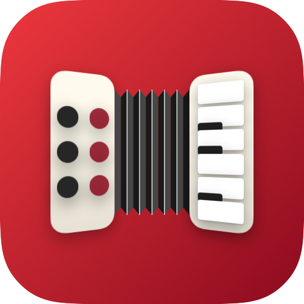
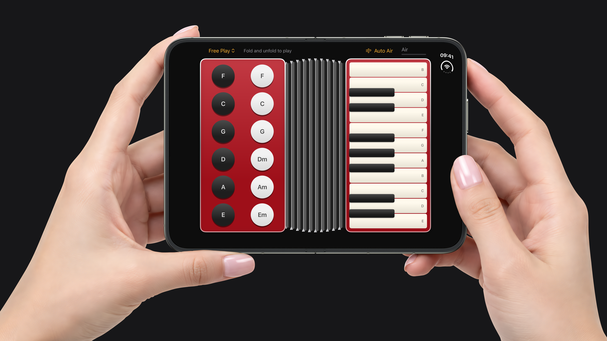

<p align="center">
  
</p>

<h1 align="center">Accorduon</h1>

<p align="center">
  An accordion for the foldable <b>iPhone Duo</b>. The hinge is the bellows: fold and unfold to play.
</p>

<p align="center">
  
  
  
  
  <a href="LICENSE"></a>
</p>

<p align="center">
  
</p>

## How to Play

Hold the iPhone Duo open like a book.

- **Right hand** plays the melody on the piano keyboard. As on a real accordion, it runs vertically, with low notes at the top.
- **Left hand** plays the bass. Black buttons play a single bass note; white buttons play a chord (F, C, G, Dm, Am, Em).
- **Fold and unfold** to push air through the reeds. Holding a key doesn't make a sound until the bellows move, and the faster you move the hinge, the louder and brighter it plays.

Pick a song from the menu (Ode to Joy, Twinkle, Twinkle, Jingle Bells, Happy Birthday, or Katyusha) and the next key lights up.

No hinge? Drag the bellows with a finger, or turn on **Auto Air** to keep them full. Auto Air also helps in the simulator, where a single mouse pointer can't hold a key and fold the device at the same time.

## How It Works

**The hinge is the bellows.** [`AccordionView`](Accorduon/App/AccordionView.swift) listens to `onHingeChange` and turns the hinge speed, in degrees per second, into air pressure. The air leaks out on its own, so the sound fades as soon as you stop folding. The hinge angle also drives the bellows drawing: the pleats deepen and darken as you fold.

```swift
.onHingeChange { _, newContext in
    guard let degrees = newContext.hinge?.angle.degrees else { return }
    let speed = abs(degrees - last.degrees) / seconds
    audio.synth.pump(speed / 120)
}
```

**The sound is synthesized, not sampled.** [`ReedSynth`](Accorduon/Audio/ReedSynth.swift) models the parts that make an accordion sound like one:

- Three reeds per note, tuned −12, 0, and +12 cents. Their beating is the "wet" musette shimmer.
- A quieter reed an octave below for body.
- A narrow, anti-aliased (PolyBLEP) pulse for each reed, instead of a raw sawtooth.
- Two resonances that stand in for the reed chamber.
- A short pitch bend on attack and air hiss while keys are down.

It renders through an `AVAudioSourceNode`, with state behind a `Mutex`.

**Multi-touch keys.** Both keyboards use `SpatialEventGesture`, so you can play chords and slide between keys.

## Requirements

- Xcode 27.1+
- iOS 27.1+ SDK
- iPhone Duo simulator or device for the hinge. On other devices, drag the bellows or use Auto Air.

## Building

```bash
xcodebuild -project Accorduon.xcodeproj -scheme Accorduon \
  -destination 'platform=iOS Simulator,name=iPhone Duo' build
```

## Project Structure

```
Accorduon
├── App          # App entry point and the main screen
├── Audio        # Reed synthesizer and audio engine
├── Instrument   # Bellows, treble keyboard, bass buttons
├── Music        # Notes, songs, and the song bar
└── Resources    # Asset catalog
```

The Xcode project uses Xcode's JSON project format ([`project.xcproj`](Accorduon.xcodeproj/project.xcproj)). Each source file is listed there with its target membership.

## Inspiration

Hinge-controlled games on Android foldables, like [Kami](https://9to5google.com/2026/01/14/kami-another-foldable-game/), an origami game you play by folding the phone.

For more iPhone Duo APIs, see [iPhone Duo by Examples](https://github.com/artemnovichkov/iPhone-Duo-by-Examples).

## Author

Artem Novichkov, https://artemnovichkov.com/

## License

The project is available under the MIT license. See the [LICENSE](./LICENSE) file for more info.
